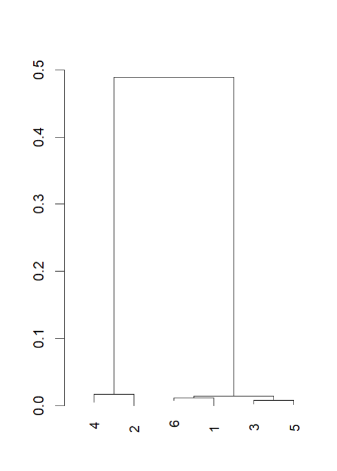

# BIO410-Final-Project

## Background
The data consist of 6 samples from the Zaire Ebolavirus. This virus is a type of virus that causes fatal hemorrhagic fever in humans and mammals [https://pubmed.ncbi.nlm.nih.gov/37355146/]. It is a negative-sense, single-stranded RNA virus and includes six species. The Ebola virus was first discovered in 1976 and has been involved in major outbreaks in West Africa (https://pmc.ncbi.nlm.nih.gov/articles/PMC7993122/). 

## Purpose
The purpose of this project was to construct a phylogenetic tree from 6 Zaire ebolavirus samples from patients to determine the evolutionary relationships among them.

## Methods
-The sequencing reads came from Next Gen Seq. The raw sequencing reads are in the .fq files 
- Assembled the sequence using MEGAHIT, which is found in the folder final.contig.fa (https://github.com/voutcn/megahit)
- Aligned the sequence using the package DECIPHER. The sequence is found in the .html file. 
- Then, created a phylogenetic tree using the ML method in the R package DECIPHER
- Used BLASTN to determine what organism the sequence came from. 
- The R script for aligning the sequence and creating the phylogeny tree is found in the folder R-seq alignment. 

## Results
Here is the Phylogenetic tree 

(The following figure shows the evolutionary relationship between the different samples of Ebola Virus). 

From the results, samples 2 and 4 appear to be more closely related. Samples 1, 6, 3, and 5 appear closely related because they cluster in a single region. 
Based on the phylogenetic tree, the samples came from  six different patients because each sample is represented with a different node. 
